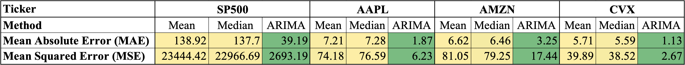
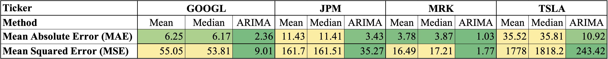
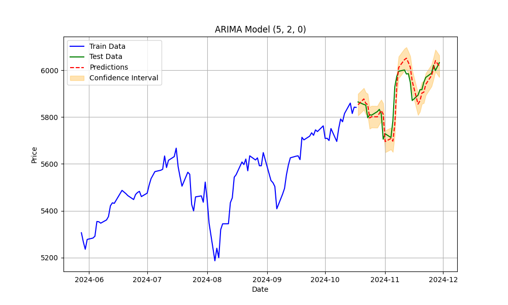
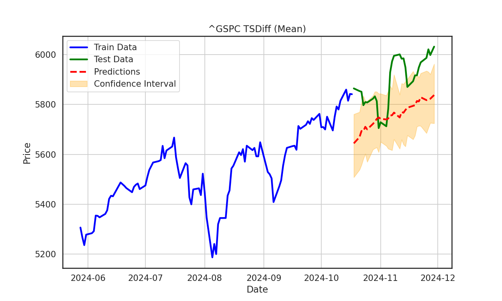

# **Stock Price Forecasting using ARIMA and TSDiff**
### Team :- Arun , Rohit, Sunith

This project compares the performance of the **ARIMA** model with the **TSDiff** model on stock price prediction tasks using stock data collected from Yahoo Finance. The goal is to evaluate the accuracy and trend-following capabilities of both models on real-world financial time series data.

---

## **Project Overview**

Stock price prediction is a challenging task due to its highly volatile and non-stationary nature. In this project, we use the ARIMA (AutoRegressive Integrated Moving Average) model as a baseline and compare it to the probabilistic **TSDiff** model, introduced in the paper:  

**"Predict, Refine, Synthesize: Self-Guiding Diffusion Models for Probabilistic Time Series Forecasting"**  

- **Original Paper**: [arXiv:2307.11494](https://arxiv.org/abs/2307.11494)  
- **Original GitHub Repository**: [TSDiff Official Repo](https://github.com/amazon-science/unconditional-time-series-diffusion/tree/main)

---

## **Dataset**

We collected stock price data using the **Yahoo Finance API**. The following tickers were selected for experimentation (no specific rationale for the selection): **S&P 500 (^GSPC)**, **AAPL (Apple)**, **AMZN (Amazon)**, **CVX (Chevron)**, **GOOGL (Alphabet)**, **JPM (JPMorgan Chase & Co.)**, **MRK (Merck & Co.)** and **TSLA (Tesla)**.

- **Timeframe**: 2000-01-01 to 2024-11-30  
- **Train-Test Split**:  
  - Training Data: All data prior to the last 30 days.  
  - Test Data: Final 30 days of the dataset.  
- **Feature Used**: Adjusted Close Price  

---

## **Models**

### **1. ARIMA (Baseline Model)**
The ARIMA model was implemented using the `pmdarima` library, which includes an **AutoARIMA** function to automatically determine the best `(p, d, q)` parameters.  

- **(p, d, q)**:  
  - `p`: Order of the autoregressive (AR) component  
  - `d`: Differencing order to make the series stationary  
  - `q`: Order of the moving average (MA) component  

For each point in the test data, the ARIMA model was retrained using the previous time steps to predict the next point.  

---

### **2. TSDiff (Diffusion Model)**
The TSDiff model is a probabilistic model trained to generate time series data by modeling the distribution of observed data.  

- **Key Hyperparameters**:  
  - Normalization: **Mean**  
  - Gradient Clipping Value: **0.5**  
  - Sampler Method: **DDPM (Denoising Diffusion Probabilistic Model)**  
  - Quantile Guidance: Used to stabilize the forecast generation  
  - Epochs: **200**  
  - Context Length: **30** (Previous 30 points used for prediction)  
  - Prediction Length: **1**  

The TSDiff model generates 100 samples for each prediction point, and the **mean** and **median** of the sampled points were used as the final predictions.  

---

## **Results**

The performance of ARIMA and TSDiff models was evaluated using the following metrics:   
- **Mean Absolute Error (MAE)**  
- **Mean Squared Error (MSE)**  

 

<em>Evaluation of ARIMA and TSDiff models on test data.</em>

 

<em>ARIMA and TSDiff predictions (mean and median) on S&P 500 (^GSPC) test data.</em>

### **Key Observations**  
- ARIMA consistently outperformed the TSDiff model with lower MAE and MSE for all stock tickers.  
- The ARIMA model closely followed the actual price movements, whereas the TSDiff model captured the general trend but failed to precisely match the price points.  
- This difference arises because TSDiff is a **probabilistic model** that generates forecasts by sampling from a learned distribution, which works better for periodic time series data but may not perform well for highly volatile stock data.  

---

## **Dependencies**

- `pandas`  
- `numpy`  
- `matplotlib`  
- `yfinance`  
- `pmdarima`  
- `torch`  
- `tsdiff` (from the official repo)

---
